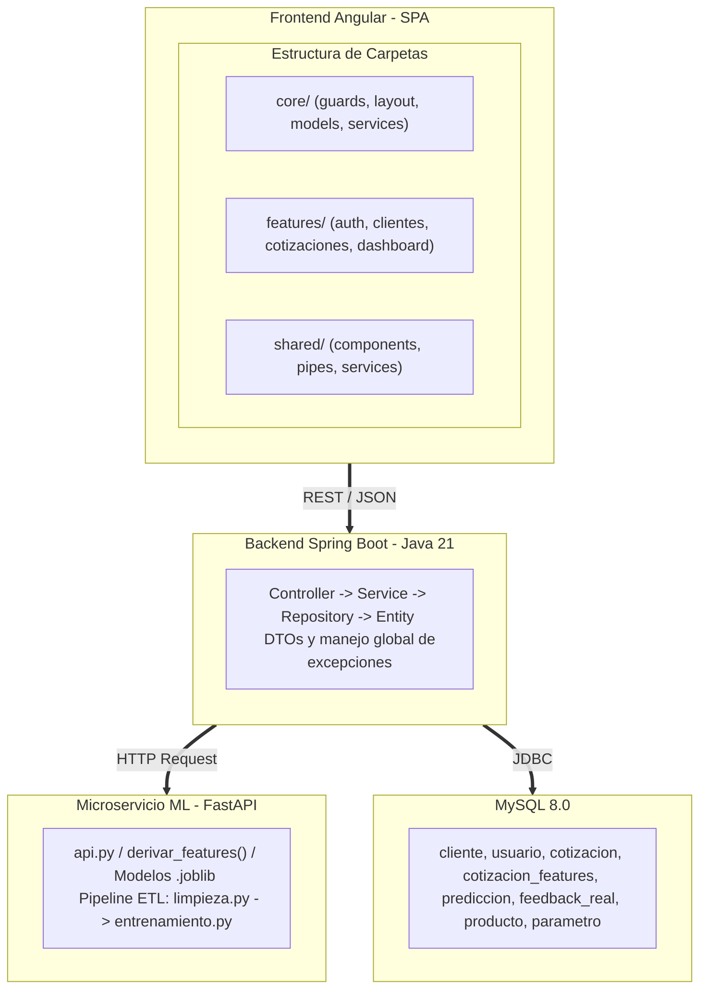

```mermaid
flowchart TD
    subgraph FE [Frontend Angular - SPA]
        direction TB
        subgraph FE_Structure [Estructura de Carpetas]
            direction LR
            FE_Core["core/ (guards, layout, models, services)"]
            FE_Feat["features/ (auth, clientes, cotizaciones, dashboard)"]
            FE_Shared["shared/ (components, pipes, services)"]
        end
    end

    subgraph BE [Backend Spring Boot - Java 21]
        direction TB
        BE_Arch["Controller -> Service -> Repository -> Entity <br/> DTOs y manejo global de excepciones"]
    end

    subgraph ML [Microservicio ML - FastAPI]
        ML_Arch["api.py / derivar_features() / Modelos .joblib <br/> Pipeline ETL: limpieza.py -> entrenamiento.py"]
    end

    subgraph DB [MySQL 8.0]
        DB_Arch["cliente, usuario, cotizacion, cotizacion_features, prediccion, feedback_real, producto, parametro"]
    end

    FE ==>|REST / JSON| BE
    BE ==>|HTTP Request| ML
    BE ==>|JDBC| DB
```
